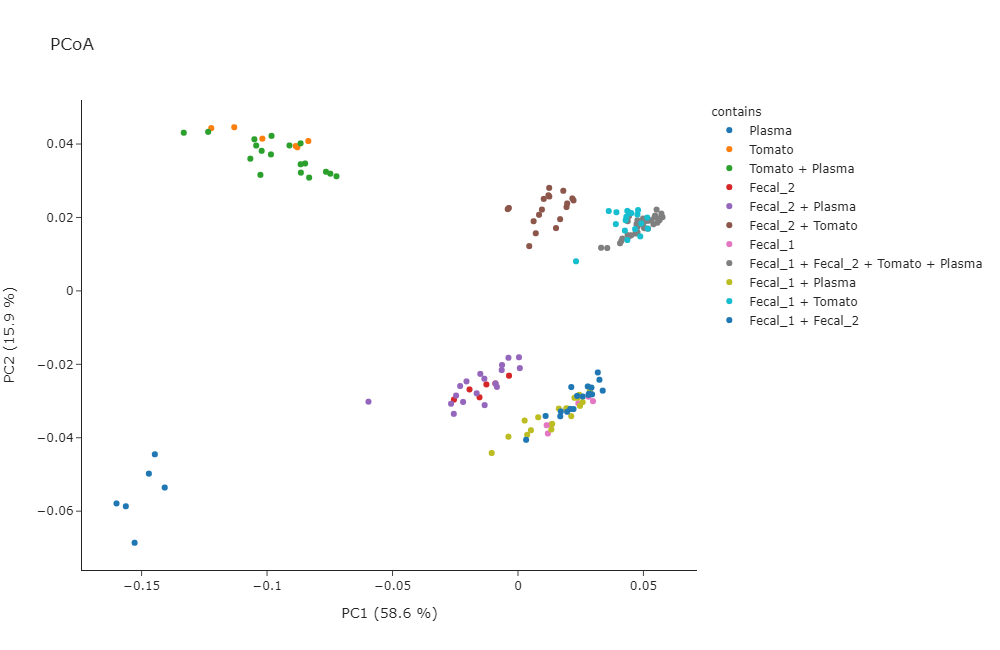
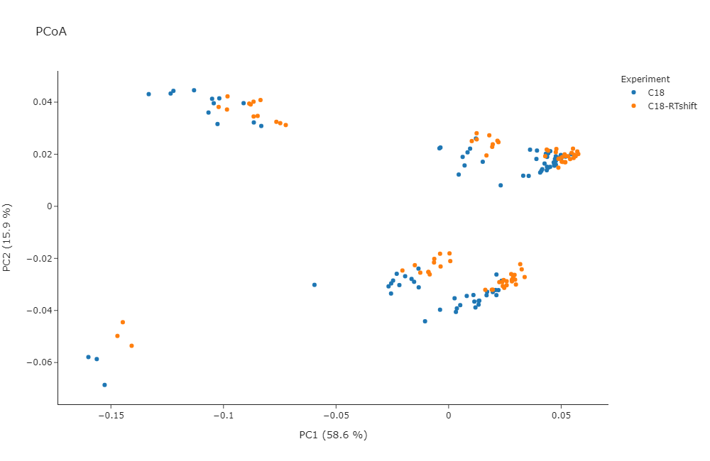
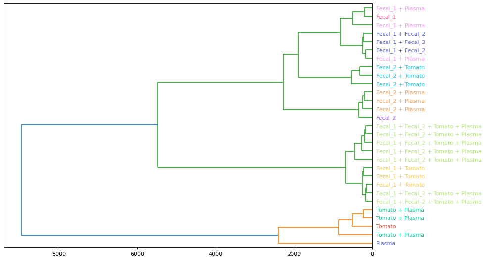
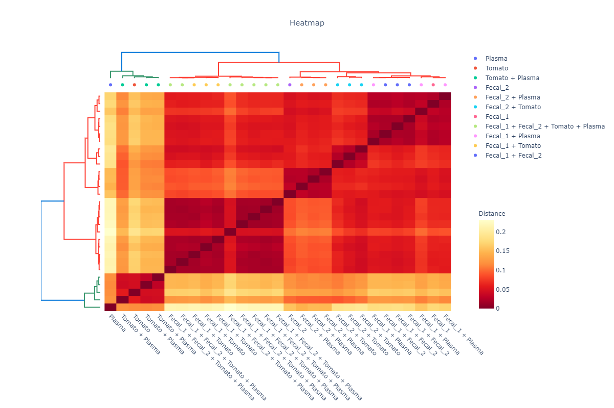

# memo

**M**s2 bas**E**d sa**M**ple vect**O**rization (**MEMO**) package

## Description

MEMO is a method allowing a Retention Time (RT) agnostic alignment of metabolomics samples using the fragmentation spectra (MS2) of their consituents.

The occurence of MS2 Peaks and Neutral Losses in each sample is counted and used to generate an *MS2 fingerprint* of the sample. These fingerprints can in a second stage be aligned to compare different samples. Once obtained, different filtering (remove peaks/losses from blanks for example) and visualization techniques (MDS/PCoA, TMAP, Heatmap, ...) can be used. 

MEMO suits particularly well to compare chemodiverse samples, ie with a poor features overlap, or to compare samples with a strong RT shift, acquired using different LC methods or even different mass spectrometers technology (Maxiis qToF vs Q-Exactive).

### Small preview of the results on the Qemistree Evaluation Dataset:

The Tutorial uses the [Qemistree Evaluation Dataset](https://www.nature.com/articles/s41589-020-00677-3). This dataset contains samples analyzed on a Q-Exactive using 2 different LC methods simulating a really strong batch effect. Samples originates from 2 fecal samples, 1 tomato sample & 1 plasma sample (+ binary and quaternary mixtures of these 4 samples).

#### Samples colored according to their content


#### Samples colored according to their LC method


#### Samples clustered using HCA


#### Samples clustered using HCA and Heatmap visualization



MEMO is mainly built on [matchms](https://github.com/matchms/matchms) and [spec2vec](https://github.com/iomega/spec2vec) packages for handling the MS2 spectra and convert them into documents. Huge thanks to them for the amazing work done with these packages!

### To install it:

First make sure to have [anaconda](https://www.anaconda.com/products/individual) installed.

#### A) Clone and install locally
A.1. First clone the repository using git clone in command line:
```
git clone <ssh_key or https>
```
A.2. Create a new conda environment to avoid clashes:
```
conda create --name memo python
conda activate memo
```

A.3. Install the package locally using pip:
```
pip install .
```
#### B) Using test.pypi (Not recommended for now!)

B.1. Create a new conda environment to avoid clashes:
```
conda create --name memo python=3.8
conda activate memo
```
B.2. Install with pip from test.pypi (experimental):
```
pip install --index-url https://test.pypi.org/simple/ --extra-index-url https://pypi.org/simple/ memo-ms
```

If you have an error, try instllaing scikit-bio from conda-forge before installing the package with pip:
```
conda install -c conda-forge scikit-bio
pip install --index-url https://test.pypi.org/simple/ --extra-index-url https://pypi.org/simple/ memo-ms
```

You can clone the repository to get the demo spectra and quant table files!

#### Enjoy!

Once installed, try it using the tutorial jupyter notebook.

Please add feedback to the issues section. Thanks !

## Documentation for developers

#### Installation
Create an environment with
```
git clone https://github.com/mandelbrot-project/memo.git
cd memo
conda create --name memo-dev python=3.8
conda activate memo-dev
```
Then install dependencies and memo:
```
python -m pip install --upgrade pip
pip install numpy
pip install --editable .[dev]
# pip install -e .'[dev]' (on mac)
```

#### Run tests
Memo tests can be run by:
```
pytest
``` 
And the code linter with
```
prospector
```
